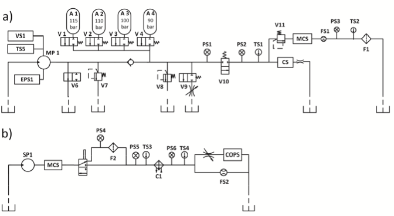

# predictive-maintenance-pytorch
Deep Learning applied to condition based monitoring of a complex hudraulic system

## Backround
The data set was experimentally obtained with a hydraulic test rig. This test rig consists of a primary working and a secondary cooling-filtration circuit which are connected via the oil tank [1]. The system cyclically repeats constant load cycles (duration 60 seconds) and measures process values such as pressures, volume flows and temperatures while the condition of four hydraulic components (cooler, valve, pump and accumulator) is quantitatively varied. 

  

## Data
The data set addresses the condition assessment of a hydraulic test rig based on multi sensor data. Four fault types are superimposed with several severity grades impeding selective quantification.

## References 
[1] N. Helwig, et al., "Condition monitoring of a complex hydraulic system using multivariate statistics," 2015 IEEE International Instrumentation and Measurement Technology Conference (I2MTC) Proceedings, Pisa, 2015, pp. 210-215.
