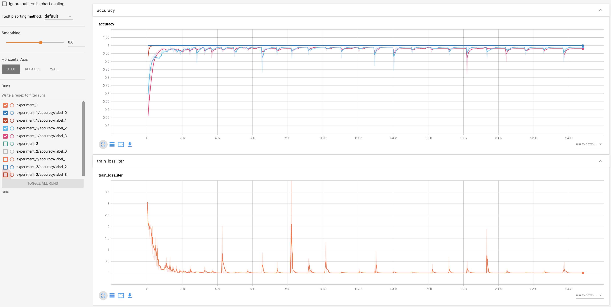
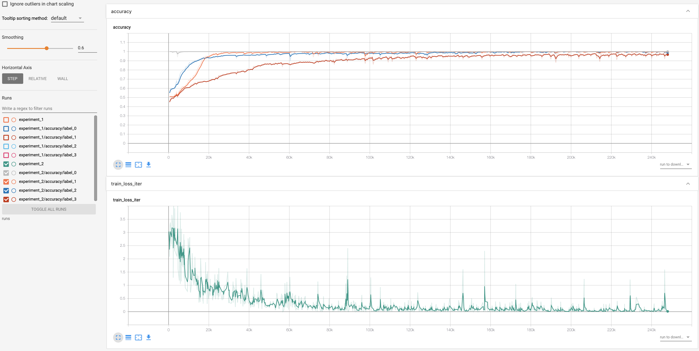

# predictive-maintenance-pytorch
Deep Learning applied to condition based monitoring of a complex hydraulic system

## Backround
The data set was experimentally obtained with a hydraulic test rig. This test rig consists of a primary working and a secondary cooling-filtration circuit which are connected via the oil tank [1]. The system cyclically repeats constant load cycles (duration 60 seconds) and measures process values such as pressures, volume flows and temperatures while the condition of four hydraulic components (cooler, valve, pump and accumulator) is quantitatively varied. 
<p align="center">
  
</p>

## Dataset
The data set is the [Condition monitoring of hydraulic systems Data Set](http://archive.ics.uci.edu/ml/datasets/Condition+monitoring+of+hydraulic+systems) contained in UCI Machine Learning Repository. It addresses the condition assessment of a hydraulic test rig (shown above) based on multi sensor data. Four fault types are superimposed with several severity grades impeding selective quantification.

## Data Preparation
Data samples consist of sequences of measurements acquired by 17 different sensors during testing cycles with durationof 60 seconds. Different sensor types can hace different sampling rates, specifically 1, 10, and 100 Hz which correspond to sequence lenghts of respectively 60, 600, and 6000 samples. All the sequences are interpolated into a unique sampling rate in `prepare_data.py` to allow feeding all data into the same model. Downsampling is also taken into account as this is needed in LSTM which is known to perform poorly for long sequences. From the original data set, sensors whose correlation is above 95% are eliminated as shown in the [notebook](https://github.com/France1/predictive-maintenance-pytorch/blob/master/notebooks/Data_preparation.ipynb). This step reduced the number of sensors to the final set 
```
{'CP','FS1','PS1','PS2','PS3','PS4','PS5','SE', 'VS1','profile'}
```
where `profile` contains the severity grade classes for each fault type.

## Multi-task Condition Based Classification
The problem is approached as a multi-task classification in which each task is represented by the type of fault to be monitored.  Each fault contains different severity grades representing the classes to predict. Instead of training different models for different fault types, a unique model is trained end-to-end by defining a multi-task [loss function](https://discuss.pytorch.org/t/how-to-do-multi-task-training/14879/7). Two different backbones are used to extract the features
### 1D CNN
The 1D CNN architecture is taken from [2], which consists of two convolutional and max pool layers. Batch normalization has also been added to facilitate training
### LSTM with attention
For comparison, an LSTM architecture has been investigated. A vanilla LSTM architecture was able to achive good accuracy in a single-task problem, but failed to correclty classify the 2nd failure mode in multi-task mode under all the hyperparameter combinations. Good performances where achived only after adding the attention mechanism described in [3], with pytorch implementation inspired from this [project](https://github.com/prakashpandey9/Text-Classification-Pytorch)

## Installation
Run the PyTorch Docker container from project folder
```
sudo nvidia-docker run -it --name pdm-pytorch --ipc=host \ 
  -v "$(pwd)":/home/project \
  -p <jupyter-port>:8888 \
  -p <tensorboard-port>:6006 \
  nvcr.io/nvidia/pytorch:19.03-py3
```
where `<jupyter-port>` and `<tensorboard-port>` are the ports where you access jupyter and tensorboard servers respectively.

Access the container shell, install and run jupyterlab
```
docker exec -it pdm-pytorch /bin/bash
pip install jupyterlab
jupyter-lab --ip 0.0.0.0 --no-browser --allow-root
```

Install and run tensorboard
```
pip install tensorboardX
tensorboard --logdir runs --bind_all
```

## Training
Models were trained for 500 epochs on 90% of the data set with batch size of 4

### 1D CNN
The model was trained using a sequence length of 6000 and learning rate 1e-4
<p align="center">
  
</p>

### LSTM with attention
The model was trained using a sequence length of 50 and learning rate 1e-3
<p align="center">
  
</p>

## Results

CNN 1D shows the best performances and is the easiest to train. LSTM has comparable performances only if an attention mechanism is added, still the current configuration exhibits some overfitting. The table below shows the accuracy of classification for each fault type

|                | Train set               | Test set                |
|--------------- |:-----------------------:|:-----------------------:|
| CNN 1D         | (1.0, 1.0, 0.99, 0.98)  | (1.0, 1.0, 0.98, 0.95)  |
| LSTM+attention | (1.0, 1.0, 0.98, 0.97)  | (1.0, 0.97, 0.95, 0.88) |
| LSTM           | (1.0, 0.76, 0.98, 0.85) | (1.0, 0.75, 0.95, 0.85) |                     


## References 
[1] N. Helwig, et al., "Condition monitoring of a complex hydraulic system using multivariate statistics," 2015 IEEE International Instrumentation and Measurement Technology Conference (I2MTC) Proceedings, Pisa, 2015, pp. 210-215.

[2] Ye Yuan, et al., A general end-to-end diagnosis framework for manufacturing systems, National Science Review, Volume 7, Issue 2, February 2020, Pages 418–429, https://doi.org/10.1093/nsr/nwz190 

[3] M.Luong et al, Effective Approaches to Attention-based Neural Machine Translation, 2015, arXiv:1508.04025


